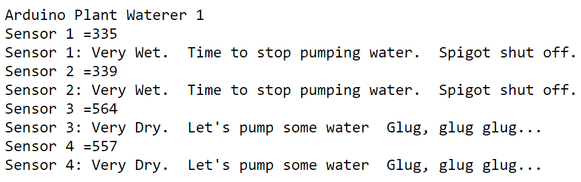
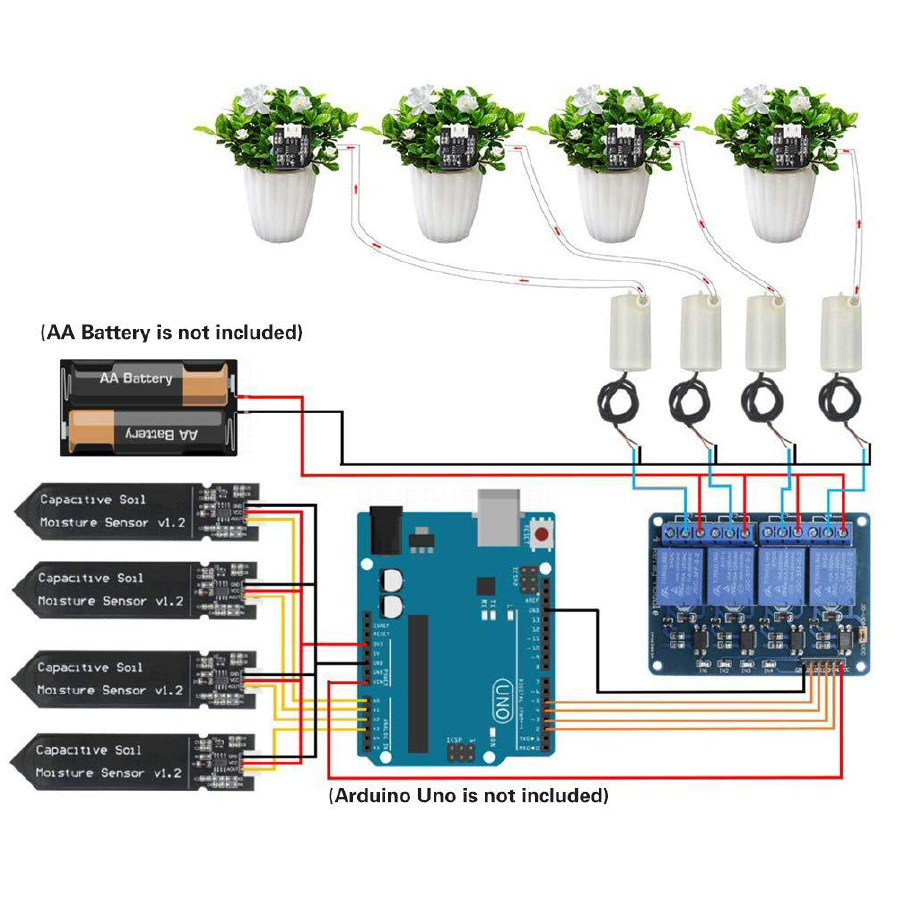

[](https://github.com/arduino-plant-waterer/actions/workflows/compile-sketch.yml)

# Arduino Plant Waterer
This Arudino project reads Capacitive Soil Moisture Sensors, measures soilMoistureValue vs AirValue vs WaterValue, and then triggers a relay module to switch water pumps on/off when needed.

## Features ✨
The sketches in this repository can be copied into your Arduino IDE and uploaded to Arduino devices:
- wifi_moisture_sensor_ssr_pump_4_terminals_mqtt.ino = SSR with notifications
- wifi_moisture_sensor_ssr_pump_4_terminals.ino = Solid state relay
- wifi_moisture_sensor_relay_pump_4_terminals.ino = Mechanical relay
- moisture_sensor_relay_pump_4_terminals.ino = No-network mechanical relay
- feather_moisture_sensor_relay_pump.ino = Adafruit Feather, 1 terminal relay

## Output
By using any of the wifi_*.ino sketches, you can view output display by connecting to the local ip address in a web browser.



And by using the wifi_moisture_sensor_ssr_pump_4_terminals_mqtt.ino sketch, you can also receive notifications via any MQTT broker!

## Getting Started 🏁

### Wiring Diagram


### Hardware Assembly
Assemble your hardware by following these steps:
1. Wire relay module to Uno & battery
2. Wire sensors to the Uno
3. Wire pumps to the relay module
4. Attach hose to the pumps

### Parts List
Here is a list of parts you will need to assemble your Arduino Plant Waterer:
- $40 = Arduino Uno Wifi R2
- $16 = 4-channel SSR Module
- $8 = 4 Capacitive Moisture Sensors
- $12 = 4 Water Pumps
- $10 = Screw Shield Expansion
- $4 = Battery Holder
- $20 = Tubing
- $15 = 22 AVG Wire
- $10 = Wallwart
- $8 = USB A to USB B Cord

$143 = Approximate total cost

### User variables
To connect your Arduino devices to a WiFi network, you will need to replace these variables with your credentials.

```
char ssid[] = "YOUR_SSID_HERE";
char pass[] = "YOUR_PASSWORD_HERE";
```

To receive MQTT notifications, you will need to replace these variables with your credentials.

```
const char broker[] = "YOUR_MQTT_BROKER_LOCAL_IP_ADDRESS_HERE";
#define BROKER_USERNAME     "YOUR_MQTT_BROKER_USERNAME_HERE"
#define BROKER_PASSWORD     "YOUR_MQTT_BROKER_PASSWORD_HERE"
```

### Software Installation
To get started programing Arduino, follow these steps:
- Download latest Arduino IDE
- Install libraries for your board
- Paste sketch & save
- Verify code
- Connect to Arduino hardware
- Confirm Serial Port
- Upload sketch
- Read logs

## License 📜

This project is licensed under the [GNU General Public License](/LICENSE.md).

## Let's Get Building! 🚀

Happy coding!